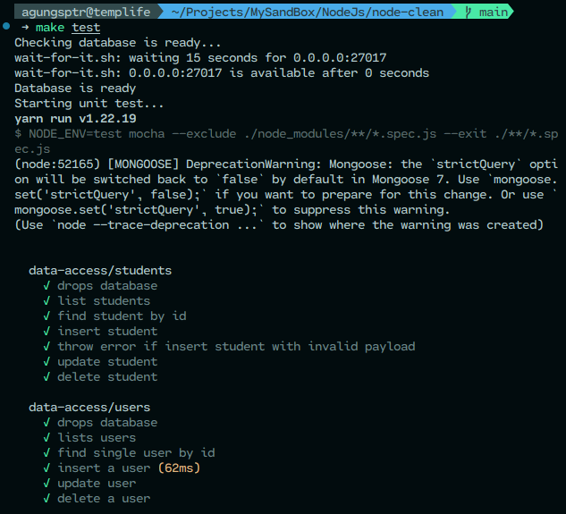
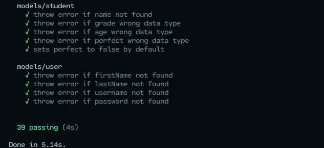
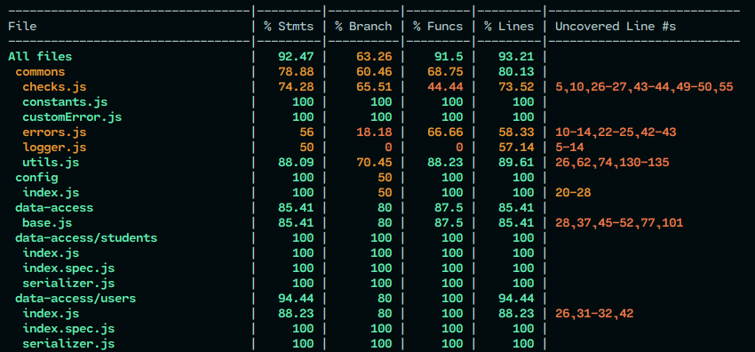
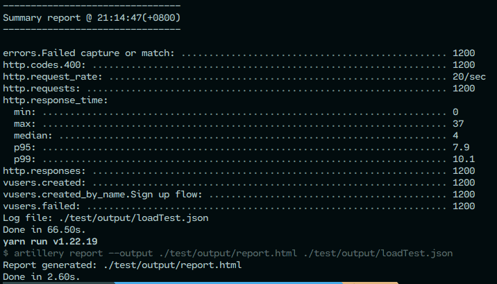
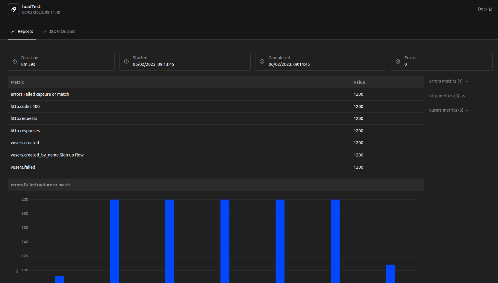

<br />
<div align="center">
  <h2 align="center" style="font-size:8vw;">Node Clean</h2>

  <p align="center">
    A Node.js project template with clean architecture implementation
    <br />
    <a href="https://github.com/agungsptr/node-clean"><strong>Explore the docs »</strong></a>
    <br />
    <br />
    <a href="https://github.com/agungsptr/node-clean/stargazers">
      
    </a>
    <a href="https://github.com/agungsptr/node-clean/network">
      
    </a>
    <a href="https://github.com/agungsptr/node-clean/network">
      
    </a>
  </p>
</div>

<details>
  <summary>Table of Contents</summary>
  <ol>
    <li>
      <a href="#about-the-project">About The Project</a>
      <ul>
        <li><a href="#feature">Feature</a></li>
        <li><a href="#built-with">Built With</a></li>
      </ul>
    </li>
    <li>
      <a href="#getting-started">Getting Started</a>
      <ul>
        <li><a href="#prerequisites">Prerequisites</a></li>
        <li><a href="#installation">Installation</a></li>
        <li><a href="#alternative-installation">Alternative Installation</a></li>
      </ul>
    </li>
    <li>
      <a href="#usage">Usage</a>
      <ul>
        <li><a href="#web-services">Web Services</a></li>
        <li><a href="#grpc">gRPC</a></li>
        <li><a href="#unit-test">Unit Test</a></li>
        <li><a href="#coverage-test">Coverage Test</a></li>
      </ul>
    </li>
    <li><a href="#contributing">Contributing</a></li>
    <li><a href="#license">License</a></li>
    <li><a href="#contact">Contact</a></li>
    <li><a href="#acknowledgments">Acknowledgments</a></li>
    <li><a href="#support-me">Support Me</a></li>
  </ol>
</details>

## About The Project

This project aims to be used as a base backend project which implements clean architecture.
I create this project to help me build a backend application faster as a template project.
Feel free to use this project as your base application.
I am very happy if you are helped by using this template.

### Features

* RESTful
* gRPC
* Authentication using JWT
* CRUDS Resources
* Unit Test
* Coverage Test
* Load Test

### Built With

* [](https://nodejs.dev)
* [](https://expressjs.com)
* [](https://www.mongodb.com)
* [](https://www.docker.com)

## Getting Started

Let's start this project...

### Prerequisites

Before you dig into this project it very nice if you understand the clean architecture concept. I recommend you to read about the **Clean Architecture** first.

* Basic javascript
* VS Code (Recommend)
* Node >= v16.15.0
* Yarn
* GNU Make
* Docker

### Installation

1. Clone the repo

   ```sh
   git clone https://github.com/agungsptr/node-clean.git
   ```

2. Install Yarn packages

   ```sh
   yarn install
   ```

3. Copy `.env.example` to `.env`

4. Setup `MongoDB` container

   ```sh
   make infra
   ```

5. Seed database

   ```sh
   make seed
   ```

6. Now you can run this project, this project running on port 7000 in your local

   ```sh
   make dev
   ```

### Alternative Installation

Follow this instruction if you do not use `docker` or in `Windows` or if you having trouble with the installation above.

1. Clone the repo

   ```sh
   git clone https://github.com/agungsptr/node-clean.git
   ```

2. Make sure that you have installed `Node`, `Yarn`, and `Mongodb` in your local

3. Install Yarn packages

   ```sh
   yarn install
   ```

4. Copy `.env.example` to `.env`

5. Setup `Mongodb`, for this you need to match your `Mongodb` to the `.env` file. To do that, please update the followings variable

   ```sh
   - MONGO_HOST (your MongoDB host, ex. localhost if using your local machine)
   - MONGO_PORT (your MongoDB port)
   - MONGO_DBNAME (database name, you need to create it first in MongoDB)
   - MONGO_USER (username to access your MongoDB)
   - MONGO_PW (password for the user)
   ```

6. Seed database

   ```sh
   yarn seed
   ```

7. Now you can run this project, this project running on port 7000 in your local

   ```sh
   yarn dev
   ```

## Usage

### Web Services

* Login

```sh
  curl --location --request POST 'localhost:7000/api/auth/login' \
  --header 'Content-Type: application/json' \
  --data-raw '{
      "username": "agungsptr",
      "password": "24434"
  }'
```

* Get All Users

```sh
  curl --location --request GET 'localhost:7000/api/users' \
  --header 'Authorization: Bearer <AuthToken>'
```

For more request examples please use this postman collection [here](./NodeClean.postman_collection.json).

### gRPC

* Start gRPC Server

```sh
  make grpc
```

After running the gRPC server, you can run example gRPC client, using this command

* Start gRPC Client

```sh
  make grpc_client
```

### Unit Test

```sh
  make test
```

The tests carried out include:

* Data Access (./data-access)
* Models (./models)
* Routes (./drivers/web/routes)

Screenshots result





### Coverage Test

```sh
  make coverage_test
```

Screenshots result



### Load Test

```sh
  make load_test
```

After you run load test command above you can see the test result in graphic, for that please open html file in `test/output/report.html`.

Screenshots result





### Available Make Commands

Infrastructure commands

* Run only db container

  ```sh
  make infra
  ```

* Build image

  ```sh
  make build
  ```

* Run all container including db and app

  ```sh
  make compose-up
  ```

* Stop all containers

  ```sh
  make compose-down
  ```

* Auto command, to build image and run all containers

  ```sh
  make auto
  ```

* Check db is ready

  ```sh
  make wait-db
  ```

* Check app is ready

  ```sh
  make wait-app
  ```

Application commands

* Run webservice

  ```sh
  make start
  ```

* Run webservice in dev mode, it will automatically restart app if there are ane changes.

  ```sh
  make dev
  ```

* Run gRPC

  ```sh
  make grpc
  ```

* Run example gRPC client

  ```sh
  make grpc_client
  ```

Database commands

* Seeding database

  ```sh
  make seed
  ```

Testing commands

* Unit testing

  ```sh
  make test
  ```

* Coverage testing

  ```sh
  make coverage_test
  ```

* Load testing, to testing the app performace

  ```sh
  make load_test
  ```

## Contributing

Contributions are what make the open-source community such an amazing place to learn, inspire, and create. Any contributions you make are **greatly appreciated**.

If you have a suggestion that would make this better, please fork the repo and create a pull request. You can also simply open an issue with the tag "enhancement".
Don't forget to give the project a star! Thanks again!

1. Fork the Project
2. Create your Feature Branch ( `git checkout -b feature/magic` )
3. Commit your Changes ( `git commit -m 'feature/magic: Add some magic'` )
4. Push to the Branch ( `git push origin feature/magic` )
5. Open a Pull Request

## License

Distributed under the MIT License. See [LICENSE](./LICENSE) for more information.

## Contact

Agung Saputra - agung.e.sptr@gmail.com

Project Link: [here](https://github.com/agungsptr/node-clean)

## Acknowledgments

Resources that help me to build this project.

* [Clean Architecture Node.js - Build a REST API](https://mannhowie.com/clean-architecture-node)
* [Clean Architecture in ExpressJS Applications (NodeJS)](https://merlino.agency/blog/clean-architecture-in-express-js-applications)
* [JavaScript dependency injection in Node – friend or foe?](https://tsh.io/blog/dependency-injection-in-node-js)
* [Patterns — Generic Repository with Typescript and Node.js](https://medium.com/@erickwendel/generic-repository-with-typescript-and-node-js-731c10a1b98e)
* [Express.js](https://expressjs.com)
* [MongoDB Documentation](https://www.mongodb.com/docs)
* [Mongoose Documentation](https://mongoosejs.com/docs)
* [gRPC Intoduction](https://grpc.io/docs/what-is-grpc/introduction)
* [gRPC Node Quick Start](https://grpc.io/docs/languages/node/quickstart)
* [Understanding Protocol Buffers](https://betterprogramming.pub/understanding-protocol-buffers-43c5bced0d47)

## Support Me

[](https://www.buymeacoffee.com/agungsptr)
<a href="https://trakteer.id/agungesptr/tip" target="_blank"></a>
